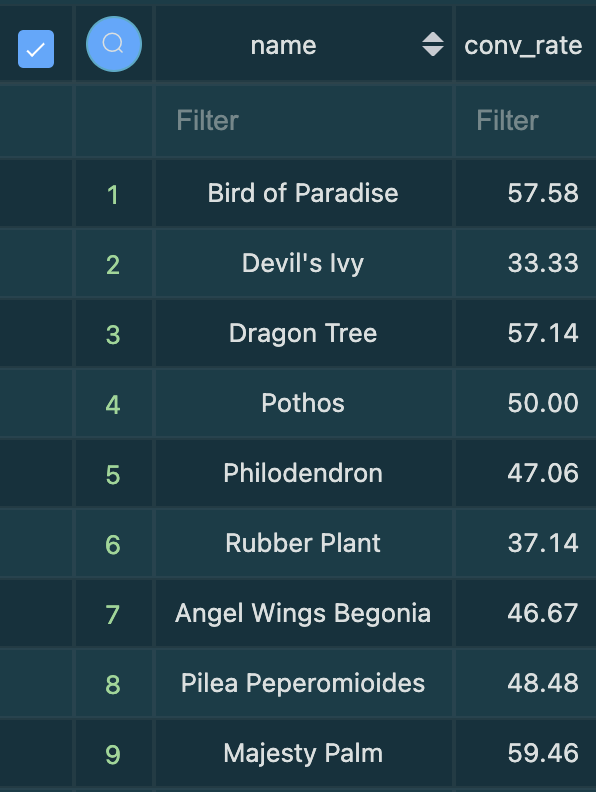

**Answers to short answer questions with queries**

(1)Create new models to answer the first two questions (answer questions in README file)

- What is our overall conversion rate?

**Query**:
dbt-greenery/models/marts/kpi/fct_conversion_by_product.sql

**Answer** : 36.1 %

- What is our conversion rate by product?

```sql
SELECT 
    name,   
    ROUND(conv_rate*100,2)  as conver_rate
    FROM dbt_raj_k.fct_conversion_by_product 
    JOIN public.products 
    USING (product_id)
```




(2) We’re getting really excited about dbt macros after learning more about them and want to apply them to improve our dbt project.

**Create a macro to simplify part of a model(s)**. Think about what would improve the usability or modularity of your code by applying a macro. Large case statements, or blocks of SQL that are often repeated make great candidates. Document the macro(s) using a .yml file in the macros directory.

Added a macro *{{sessions_with_checkout()}}* which was used repeatedly in two of the models under kpi created:

- fct_conversion_rate
- fct_conversion_by_product

 We’re starting to think about granting permissions to our dbt models in our postgres database so that other roles can have access to them.


- **Add a post hook to your project to apply grants to the role “reporting”. Create reporting role first by running "CREATE ROLE reporting" in your database instance.**

- Navigate to psql on terminal
> CREATE ROLE reporting;

- Added a post hook to dbt-greenery project by applying grants to the role reporting 
 > dbt-greenery/dbt_project.yml


(4) After learning about dbt packages, we want to try one out and apply some macros or tests.

**Install a package (i.e. dbt-utils, dbt-expectations) and apply one or more of the macros to your project**


- Installed dbt_utils and dbt_expectations by running *dbt deps* on terminal by updating the **packages.yml** (dbt-greenery/packages.yml) file

- Added a test at dbt-greenery/models/marts/core/schema.yml. to check if product id has same number of unique rows in both staging and dim table and was able to leverage **dbt-expectation** package which is a check we do all the times when we create staging/intermediate tables in a data pipeline.

(5) After improving our project with all the things that we have learned about dbt, we want to show off our work!

**Show (using dbt docs and the model DAGs) how you have simplified or improved a DAG using macros and/or dbt packages.**

- Added macros which simplified the kpi's models
- Made use of dbt-expectations packages to make sure we have same number of unique values in staging and dimension table


    
