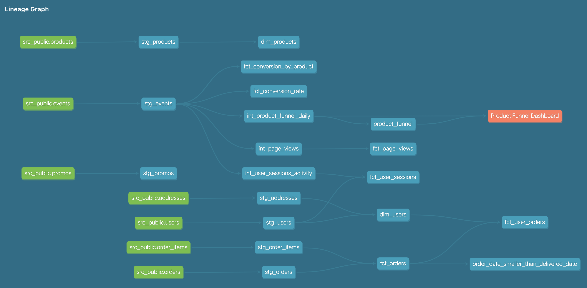

**Answers to short answer questions with queries**

We are going to tackle a data modeling challenge inspired by the real world: understanding the product funnel. This is very representative of the type of data modeling work that happens within data organizations.

1. **Modeling challenge**

Let’s say that the Director of Product at greenery comes to us (the head Analytics Engineer) and asks some questions:

- How are our users moving through the product funnel?
- Which steps in the funnel have largest drop off points?

Product funnel is defined with 3 levels for our dataset:
- Sessions with any event of type page_view / add_to_cart / checkout
- Sessions with any event of type add_to_cart / checkout
- Sessions with any event of type checkout

They need to understand how the product funnel is performing to set the roadmap for the next quarter. The Product and Engineering teams are asking what their projects will be, and they want to make data-informed decisions.

Thankfully, we can help using our data, and modeling it with dbt!

In addition to answering these questions right now, we want to be able to answer them at any time. The Product and Engineering teams will want to track how they are improving these metrics on an ongoing basis. As such, we need to think about how we can model the data in a way that allows us to set up reporting for the long-term tracking of our goals.

We’ll also want to make sure that any model feeding into this report is defined in an exposure (which we’ll cover in this week’s materials).

- Please create any additional dbt models needed to help answer these questions from our product team, and put your answers in a README in your repo

    - Created two additional models in product mart
        - **int_product_funnel_daily** (inspired from lecture notes)
        - **product_funnel**

Following query will share the results for the product funnel 
> SELECT * FROM dbt_raj_k.product_funnel;

**Answer**: 

| per_session_w_pgview  | per_sessions_w_has_add2cart_checkout_pgview  | per_sessions_w_add2cart_checkout|per_sessions_w_checkout |
| :------------ |:---------------:| :---------------:|:---------------:|
| 82.3494     | 50.76 | 28.67 | 14.56

- Use an exposure on your product analytics model to represent that this is being used in downstream BI tools. Please reference the course content if you have questions.

    

### Reflection Question

- If you are thinking about moving to analytics engineering, what skills have you picked that give you the most confidence in pursuing this next step?

    - *Happy to share with you all that I am moving into a new role at the same time when we are in the process of wrapping up this course. The datasets are being created in my new role, so best practices I learned about the modeling layers in the course would be super helpful and I look forward to implement that and help people across the company answer business questions using those datasets. Ofcourse, I would definitely bring up at a later point the benefits of using/adoption of dbt which would bring a centralized place for documentation of all the datasets across the company and test/packages would be useful for recording data quality metrics.* 